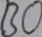

# CRNN Pytorch

## Quick Demo

```command
$ pip install -r requirements.txt
$ py predict.py
```

Everything is okay. Let's predict the demo images.

the result will be saved in output.txt file 
```command
demo_data\public_test_img_0.jpg BO
demo_data\public_test_img_1.jpg Nhoàm
demo_data\public_test_img_2.jpg NGỰC
demo_data\public_test_img_3.jpg chương
```




## CRNN + CTC

This is a Pytorch implementation of a Deep Neural Network for scene text recognition. It is based on the paper ["An End-to-End Trainable Neural Network for Image-based Sequence Recognition and Its Application to Scene Text Recognition (2016), Baoguang Shi et al."](http://arxiv.org/abs/1507.05717).

Blog article with more info: [https://ycc.idv.tw/crnn-ctc.html](https://ycc.idv.tw/crnn-ctc.html)


## Pretrained Model

This model is trained on the dataset provided by HaNoi University of science and technology. 

## Train your model

To train your own model, you must prepare your data like this structure
```bash
├───data_set
│   │   train_gt.txt
│   │
│   └───New_train
│           train_img_0.jpg
│           train_img_1.jpg
│           train_img_2.jpg
```
You could adjust hyper-parameters in `./src/config.py`.

And train crnn models,

```command
$ python vietnamese_writting\main.ipynb
```

## Acknowledgement
PThis project is built upon the work of [crnn-pytorch](https://github.com/GitYCC/crnn-pytorch)
